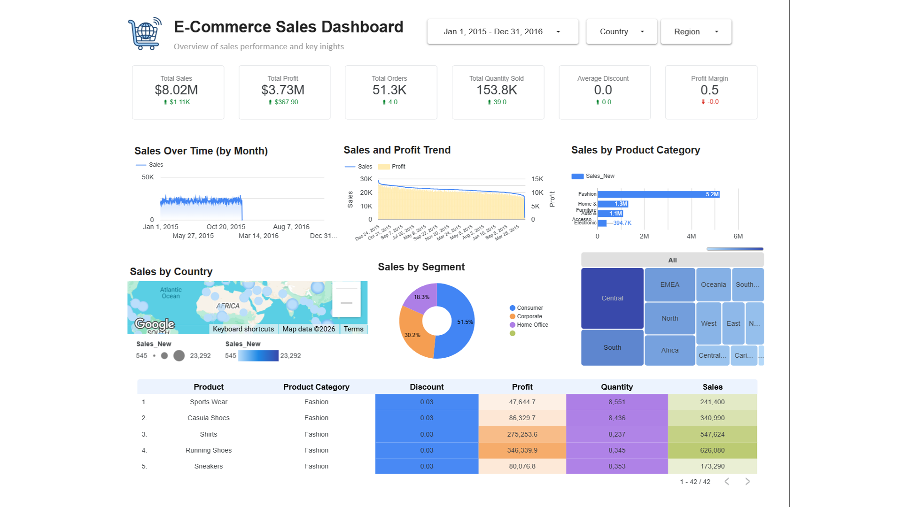

# E-Commerce Global Sales Dashboard

Interactive Google Looker Studio Dashboard for analyzing **USD 8.02M global e-commerce sales** with insights into sales performance, profitability, customer segments, regional distribution, product categories, and discount strategies.

## 📊 Dashboard Preview

<p align="center">
  
</p>

---

## 📌 Project Overview

This project presents an interactive **E-Commerce Global Sales Dashboard** developed using **Google Looker Studio**.

The dashboard transforms raw e-commerce transaction data into meaningful business insights by analyzing:

- Sales performance
- Profitability trends
- Customer segments
- Regional sales distribution
- Product category performance
- Discount impact on revenue and profit

The objective of this project is to support **data-driven decision-making** by providing a comprehensive overview of global e-commerce business performance.

---

## 🎯 Business Objectives

The dashboard aims to answer key business questions:

1. How is overall sales performance across different regions?
2. Which product categories generate the highest revenue and profit?
3. Which customer segments contribute the most sales?
4. How do discount strategies influence sales and profitability?
5. What areas require strategic improvement?

---

## 📊 Dashboard Features

### 1. Executive Summary

Provides an overview of key performance indicators (KPIs):

- Total Sales: **USD 8.02M**
- Total Profit
- Total Orders
- Customer Performance
- Overall Business Performance

---

### 2. Sales Analysis

Analyzes sales performance based on:

- Sales trends over time
- Regional distribution
- Market contribution
- Order patterns

Key insights:

- Identify high-performing regions
- Monitor sales growth
- Evaluate market performance

---

### 3. Profitability Analysis

Evaluates business profitability through:

- Profit contribution
- Profit margin
- Category profitability
- Regional profit comparison

Key insights:

- Identify the most profitable products
- Detect low-performing segments
- Evaluate business efficiency

---

### 4. Customer Analysis

Analyzes customer behavior using:

- Customer segments
- Purchase contribution
- Sales distribution

Customer segments:

- Consumer
- Corporate
- Home Office

---

### 5. Product Category Analysis

Examines performance across product categories:

- Technology
- Furniture
- Office Supplies

Key insights:

- Identify best-performing categories
- Compare revenue contribution
- Evaluate category profitability

---

### 6. Discount Strategy Analysis

Analyzes the relationship between:

- Discount percentage
- Sales volume
- Profit impact

Key insights:

- Evaluate discount effectiveness
- Identify discount strategies that may reduce profitability

---

## 🛠 Tools & Technologies

| Tool | Purpose |
|---|---|
| Google Looker Studio | Interactive dashboard development and data visualization |
| Google Sheets / CSV | Data storage and preparation |
| Data Cleaning | Data preprocessing and quality improvement |
| Business Intelligence | Generating insights for data-driven decisions |

---

## 📂 Dataset

The dataset contains global e-commerce transaction data with information including:

- Order details
- Customer information
- Product categories
- Sales
- Profit
- Discount
- Geographic regions

Dataset Source:

🔗 Google Sheets: [https://docs.google.com/spreadsheets/xxxxx](https://docs.google.com/spreadsheets/d/1q0QDSXCtfy0kzrGLWalTDcpzvUrxJ_ddegcViKaxmKk/edit?usp=sharing)

---

## 📈 Key Insights

The dashboard provides several business insights:

- Generated analysis from **USD 8.02M global e-commerce sales data**
- Identified high-performing product categories and regions
- Evaluated customer segment contribution to overall sales
- Analyzed the impact of discount strategies on profitability
- Supported business decision-making through data visualization

---

## 📌 Project Structure

```text
ecommerce-global-sales-dashboard/
│
├── 📄 README.md
│
├── 📁 dashboard/
│   └── 🖼️ dashboard_preview.png
│
├── 📁 dataset/
│   └── 📊 ecommerce_sales.csv
│
└── 📁 documentation/
    └── 📑 project_report.pdf
```

---

## 🚀 Dashboard Preview

Google Looker Studio Dashboard:

🔗 [View Interactive Dashboard](YOUR_LOOKER_STUDIO_LINK)

---

## 👩‍💻 Author

**Endah Nurfebriyanti, S.Mat.**

Mathematics | Data Analytics | Business Intelligence

Research Interests:

- Data Analytics
- Decision Support Systems
- Fuzzy Mathematics
- Business Intelligence

---

## 📬 Contact

- LinkedIn: YOUR_LINKEDIN_URL
- Google Scholar: YOUR_GOOGLE_SCHOLAR_URL
- GitHub: YOUR_GITHUB_URL

---

⭐ If you find this project useful, feel free to give it a star!
